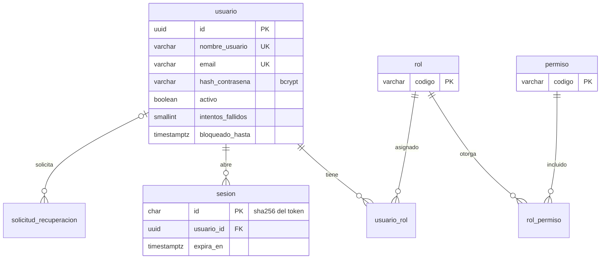
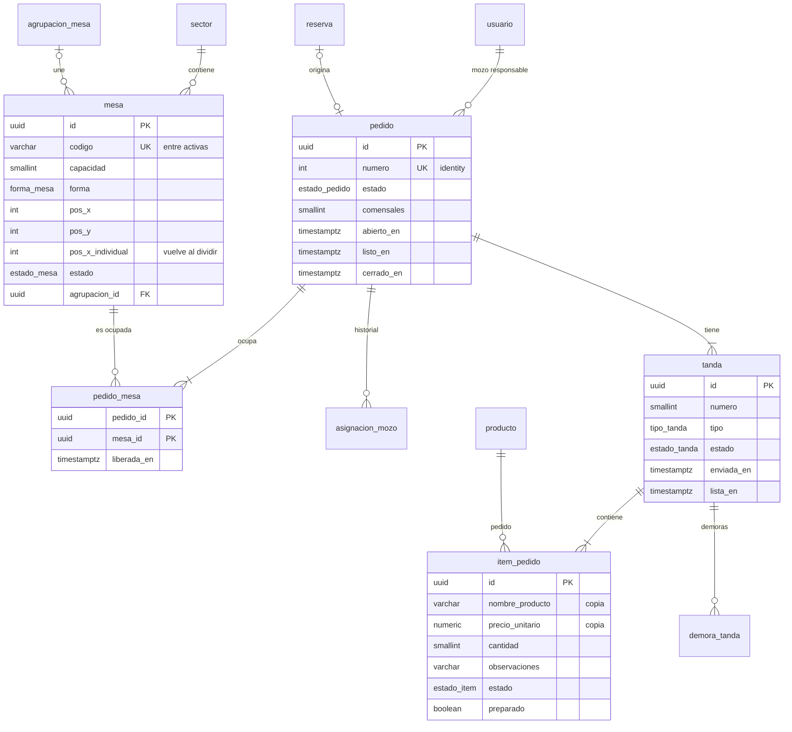
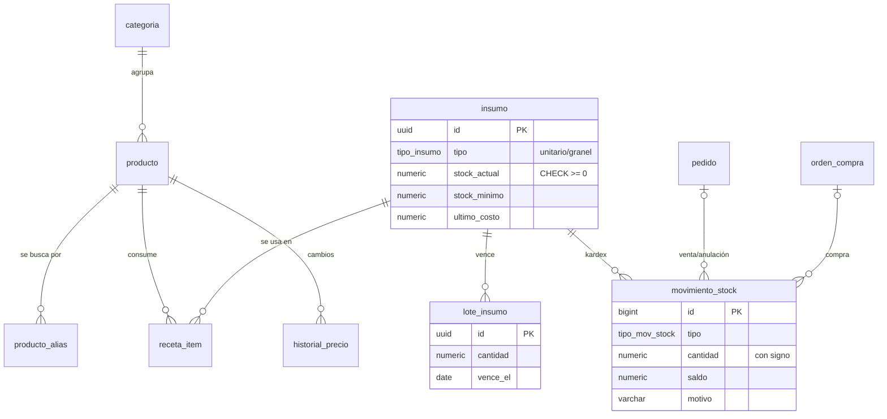
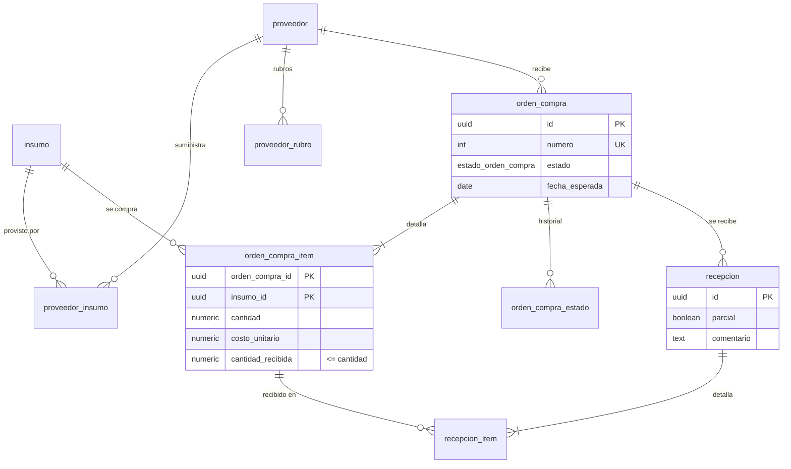
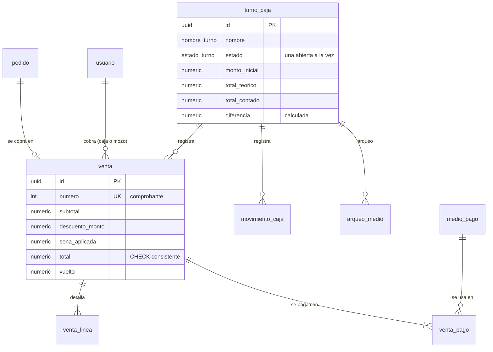
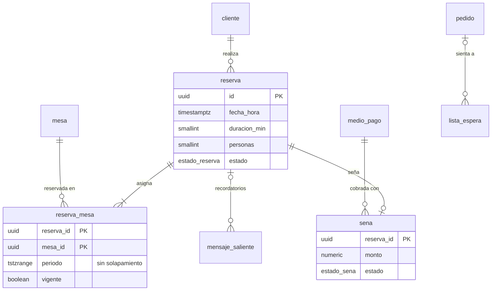

# Diseño de la base de datos

Esquema relacional para **PostgreSQL 15 o superior**: gratuito, disponible en planes sin costo (Supabase, Neon, Railway) y con restricciones avanzadas que permiten que la propia base garantice reglas del negocio (RNF-03, RNF-13).

| Archivo | Contenido |
|---|---|
| [`schema.sql`](schema.sql) | DDL completo: 51 tablas, 6 vistas, triggers, índices y datos de referencia (roles, permisos, medios de pago, configuración) |
| [`validar-esquema.mjs`](validar-esquema.mjs) | Crea el esquema en un PostgreSQL embebido (PGlite) y verifica 57 reglas: lo que debe aceptarse y lo que debe rechazarse |

```bash
npm run db:validar                                  # valida el esquema sin instalar PostgreSQL
createdb la_barra && psql -d la_barra -f database/schema.sql   # crear la base real
```

## Conexión con Supabase

La aplicación se conecta a Supabase **desde el servidor**, directo a PostgreSQL, con la cadena de conexión (`DATABASE_URL`). No usa el SDK `@supabase/supabase-js` ni la clave anon: los permisos por rol ya los aplica el servidor de Next.js y el navegador nunca accede a la base.

1. En Supabase, botón **Connect** del proyecto → **Connection string** → **Session pooler**. Copiá la cadena y reemplazá `[YOUR-PASSWORD]` por la contraseña de la base (Project Settings → Database).
2. Copiá `.env.example` como `.env.local` y pegá la cadena en `DATABASE_URL`. `.env.local` no se sube al repositorio.
3. `npm run db:probar` → verifica la conexión.
4. `npm run db:aplicar` → crea el esquema y ejecuta [`supabase-seguridad.sql`](supabase-seguridad.sql). Se niega a correr si el esquema ya existe, para no pisar datos.
5. `npm run db:probar` → confirma 51 tablas, RLS activado y API pública bloqueada. También se ve en la app, en **Configuración → Base de datos PostgreSQL**.
6. `npm run dev`. En el primer inicio, si la base no tiene usuarios, la app genera los datos de ejemplo (~4 semanas de operación) y los importa a PostgreSQL (tarda unos segundos).

> **Importante:** Supabase publica por API REST todas las tablas del esquema `public` a la clave anon, que es pública. Las tablas creadas por SQL no traen RLS activado, así que sin `supabase-seguridad.sql` cualquiera con la clave anon podría leer usuarios (con sus hashes de contraseña) y escribir ventas. Si creás las tablas a mano con `psql` o desde el SQL Editor, ejecutá también ese archivo.

## Convenciones

- Tablas y columnas en **español, snake_case y singular**, alineadas con el documento de requisitos.
- **Claves primarias**: `uuid` para entidades de negocio; `bigint identity` para historiales de alto volumen (kardex, auditoría, movimientos de caja), que además dan un orden de inserción estable.
- **Numeración visible** (pedido, comprobante, orden de compra) con columnas `identity`: nunca se repite ni depende de la aplicación.
- **Fechas** en `timestamptz` (UTC). Los reportes convierten a `America/Argentina/Buenos_Aires` (RNF-14).
- **Importes** con el dominio `dinero` = `numeric(14,2)` no negativo; **cantidades** de insumos en `numeric(12,3)` (kg, l).
- **Bajas lógicas** con `activo`/`activa`; los identificadores únicos (código de mesa, nombre de producto…) sólo se exigen entre registros activos mediante índices únicos parciales.

## Módulos y diagramas

### 1. Usuarios y seguridad (RF-AUT)



- Los permisos de cada rol quedan **en datos** (`rol_permiso`), no sólo en código: el RBAC se puede ajustar sin redeploy (RF-AUT-04/06).
- Un usuario puede tener **varios roles** (RF-AUT-05). La sesión guarda sólo el **hash** del token (RF-AUT-02/08).

### 2. Salón, pedidos y cocina (RF-MSA, RF-PED, RF-COC)



- **Unión de mesas** (RF-MSA-10/12): `agrupacion_mesa` agrupa mesas sin fusionar registros; cada mesa conserva su posición individual para volver a ella al dividir (RF-MSA-11).
- **Pedido consolidado** (RF-PED-04): la relación `pedido_mesa` permite que un pedido ocupe varias mesas. Un índice único parcial impide **dos pedidos activos en la misma mesa**.
- **Tandas independientes** (RF-PED-02.1/07): cada tanda tiene su estado y sus marcas de tiempo, insumo del reporte de tiempos de cocina (RF-COC-05, RF-REP-06). Sólo puede existir **una tanda en borrador** por pedido.
- **Precio congelado**: `item_pedido` copia nombre y precio al momento del pedido; un cambio posterior de precio no altera cuentas abiertas ni reportes.
- **Demoras de cocina**: `demora_tanda` guarda el historial y sólo admite una demora vigente por tanda; un trigger la da por resuelta cuando la tanda queda lista.

### 3. Catálogo y stock (RF-ADM-01/02, RF-STK)



- `stock_actual` tiene `CHECK (stock_actual >= 0)`: con el descuento atómico `UPDATE insumo SET stock_actual = stock_actual - :n WHERE id = :id AND stock_actual >= :n`, dos ventas simultáneas **no pueden dejar stock negativo** (RF-STK-04, RNF-03).
- El kardex (`movimiento_stock`) exige motivo en los ajustes (RF-STK-08) y referencia al pedido u orden de compra que originó el movimiento.
- Cada cambio de precio se registra automáticamente en `historial_precio` por trigger, con el usuario que lo hizo (RNF-09).

### 4. Proveedores y compras (RF-PRV)



- **Recepción parcial** (RF-PRV-07): cada recepción registra lo recibido y un comentario; los faltantes se obtienen de `cantidad - cantidad_recibida` (vista `v_faltantes_orden_compra`). Una clave foránea compuesta impide recibir insumos que no estén en la orden.
- **Evolución de costos** (RF-PRV-09): consulta sobre `orden_compra_item` por insumo, ordenada por fecha.

### 5. Caja y cobros (RF-CAJ)



- Un índice único parcial garantiza **una sola caja abierta** a la vez.
- `venta` tiene `CHECK (total = subtotal - descuento_monto - sena_aplicada)` y `pedido_id` único: **un pedido no puede cobrarse dos veces**. `cobrada_por` registra quién cobró, sea la caja o el mozo en la mesa.
- Pagos combinados en `venta_pago` (RF-CAJ-03); arqueo por medio de pago en `arqueo_medio`, con la diferencia calculada por la base (RF-CAJ-08/09).

### 6. Reservas (RF-RES)



- **Sin superposiciones** (RF-RES-02): `reserva_mesa` tiene una restricción de exclusión `EXCLUDE USING gist (mesa_id WITH =, periodo WITH &&) WHERE (vigente)`. Aunque dos personas reserven al mismo tiempo, **la base rechaza** dos reservas vigentes que se pisen en la misma mesa. Los triggers mantienen `periodo` y `vigente` sincronizados cuando la reserva cambia de horario o se cancela.
- El historial por cliente (RF-RES-09) sale de `reserva` agrupada por `cliente_id`; el teléfono normalizado permite reconocer al mismo cliente aunque escriba el número con otro formato.

### 7. Notificaciones y auditoría (RF-ADM-06, RNF-09)

- `notificacion` admite un destinatario directo (`usuario_id`) o **roles** (`notificacion_rol`); las lecturas se registran por usuario (`notificacion_lectura`). La columna `clave` evita duplicar alertas automáticas (por ejemplo, un lote por vencer).
- `auditoria` es de **sólo inserción**: un trigger rechaza cualquier `UPDATE` o `DELETE`. Registra usuario, acción, entidad, detalle y, opcionalmente, valores anteriores y nuevos en `jsonb`.

## Reglas del negocio garantizadas por la base

| Regla | Requisito | Mecanismo |
|---|---|---|
| Código de mesa único entre mesas activas | RF-MSA-01 | Índice único parcial |
| Una mesa, un pedido activo | RF-PED-04 | Índice único parcial en `pedido_mesa` |
| Una sola tanda en borrador por pedido | RF-PED-02 | Índice único parcial |
| Tanda enviada con fecha de envío; lista con fecha de listo | RF-COC-05 | `CHECK` |
| Stock nunca negativo | RF-STK-04 | `CHECK` + descuento atómico |
| Ajuste de stock con motivo | RF-STK-08 | `CHECK` |
| Sin reservas superpuestas en la misma mesa | RF-RES-02 | Restricción de exclusión (GiST) |
| Una sola caja abierta | RF-CAJ-01 | Índice único parcial |
| Total de la venta consistente; un cobro por pedido | RF-CAJ-03/04 | `CHECK` + `UNIQUE` |
| Cierre de caja con arqueo completo | RF-CAJ-02/08 | `CHECK` |
| Anulación de pedido con motivo | — | `CHECK` |
| Recepción sólo de insumos de la orden y sin exceder lo pedido | RF-PRV-07 | FK compuesta + `CHECK` |
| Historial de precios automático | RNF-09 | Trigger |
| Auditoría inmutable | RF-ADM-06, RNF-09 | Trigger |
| Contraseñas sólo como hash | RF-AUT-07 | Columna `hash_contrasena` |

Todas estas reglas se prueban en `npm run db:validar`.

## Vistas

| Vista | Uso |
|---|---|
| `v_cola_cocina` | Tandas pendientes en orden de llegada, con mesas, mozo y demora vigente (RF-COC-01) |
| `v_alerta_stock_minimo` | Insumos en o por debajo del mínimo (RF-STK-05) |
| `v_alerta_vencimientos` | Lotes vencidos o por vencer según la configuración (RF-STK-07) |
| `v_faltantes_orden_compra` | Faltantes de recepciones parciales (RF-PRV-07) |
| `v_ventas_diarias` | Facturación, tickets y ticket promedio por día en hora argentina (RF-REP-01/08) |
| `v_tiempos_cocina` | Promedio pendiente→listo por tipo de tanda (RF-REP-06) |

## Cómo la usa la aplicación

Los servicios de `src/server/services/` trabajan con colecciones de documentos a través de la interfaz `DataStore` (`src/server/store.ts`), que tiene dos implementaciones:

- **`PgStore`** (`src/server/db/pg-store.ts`): se usa cuando está definida `DATABASE_URL`. Cada colección tiene un *mapper* (`src/server/db/mappers.ts`) que la lee y escribe en las tablas relacionales; las escrituras corren en una transacción con un bloqueo `pg_advisory_xact_lock` que las serializa, y cada cambio incrementa la versión de la tabla `metadato`, que alimenta el tiempo real y la caché de lecturas.
- **`SqliteStore`**: sin `DATABASE_URL`, la app funciona sola con SQLite embebido (`data/bar.db`), útil para probar sin servidor.

`npm test` corre las pruebas sobre SQLite y `npm run test:pg` las mismas pruebas sobre PostgreSQL embebido con este esquema, incluyendo una importación completa de los datos de ejemplo que se compara colección por colección.

| Colección | Tablas |
|---|---|
| `users` | `usuario`, `usuario_rol` |
| `sessions`, `resetRequests` | `sesion`, `solicitud_recuperacion` |
| `config` | `configuracion`, `medio_pago` (la versión para tiempo real vive en `metadato`) |
| `sectors`, `tables`, `groups` | `sector`, `mesa`, `agrupacion_mesa` |
| `assignments` | `asignacion_mozo` |
| `categories`, `products` | `categoria`, `producto`, `producto_alias`, `receta_item`, `historial_precio` |
| `orders` (con tandas e ítems anidados) | `pedido`, `pedido_mesa`, `tanda`, `item_pedido`, `demora_tanda` |
| `supplies`, `lots`, `stockMovements` | `insumo`, `lote_insumo`, `movimiento_stock` |
| `suppliers`, `purchases` | `proveedor`, `proveedor_insumo`, `proveedor_rubro`, `orden_compra`, `orden_compra_item`, `orden_compra_estado`, `recepcion`, `recepcion_item` |
| `shifts`, `cashMovements` | `turno_caja`, `arqueo_medio`, `movimiento_caja` |
| `sales` | `venta`, `venta_linea`, `venta_pago` |
| `customers`, `reservations`, `waitlist`, `outbox` | `cliente`, `reserva`, `reserva_mesa`, `sena`, `lista_espera`, `mensaje_saliente` |
| `notifications`, `audit` | `notificacion`, `notificacion_rol`, `notificacion_lectura`, `auditoria` |

## Rendimiento y respaldo

- Índices pensados para las operaciones críticas (RNF-01): cola de cocina (`tanda` pendientes por fecha de envío), pedidos activos, mesas por sector, ventas y movimientos por fecha para reportes, kardex por insumo.
- Respaldo (RNF-10): `pg_dump -Fc la_barra > respaldo.dump` y restauración con `pg_restore -d la_barra respaldo.dump`. Los planes gestionados (Supabase, Neon) incluyen respaldos automáticos; con PostgreSQL el botón de respaldo de la app se desactiva y remite al panel de Supabase.
